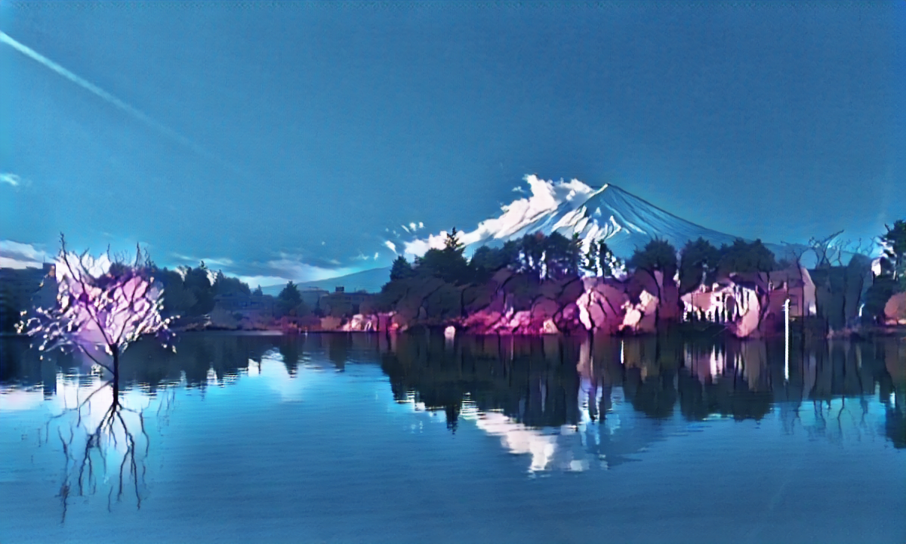
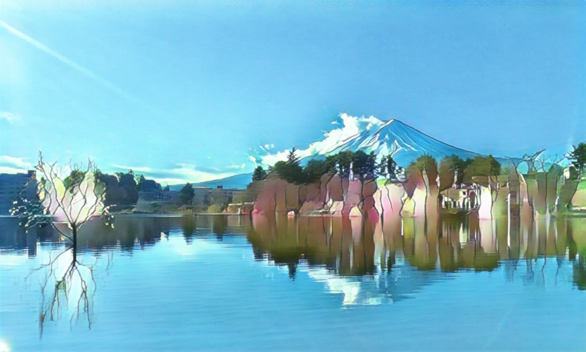
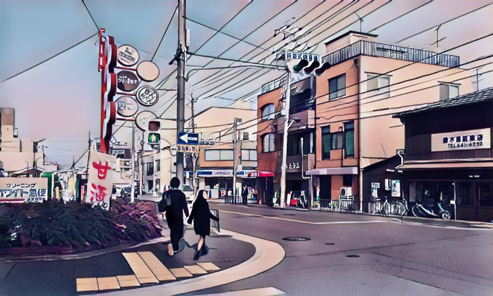
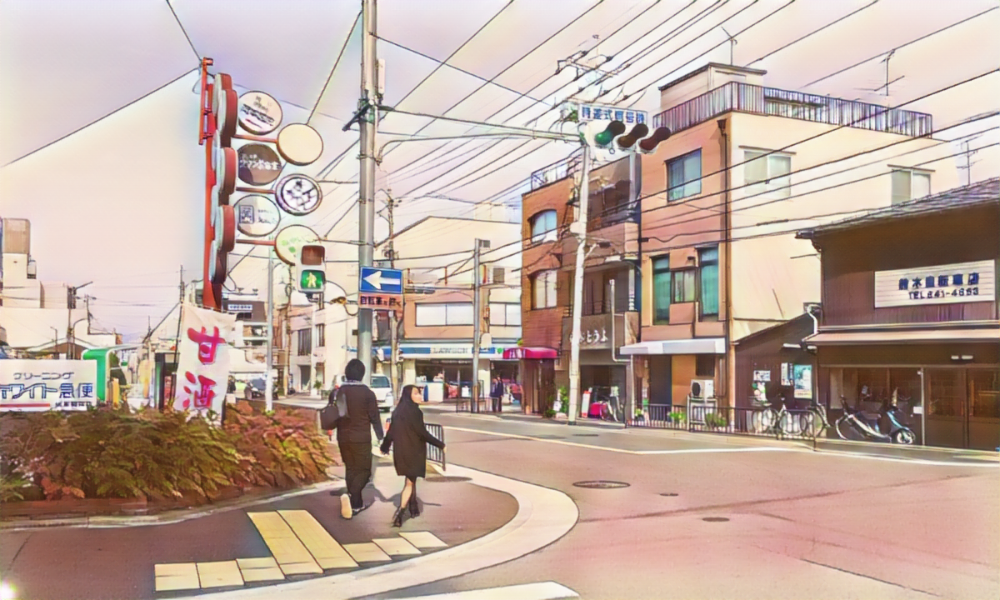
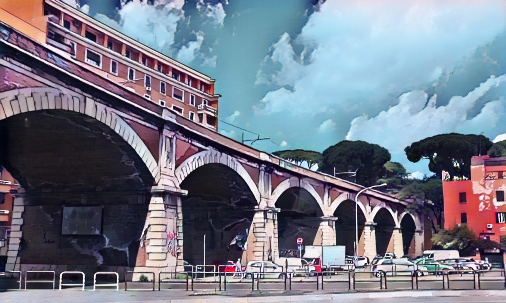
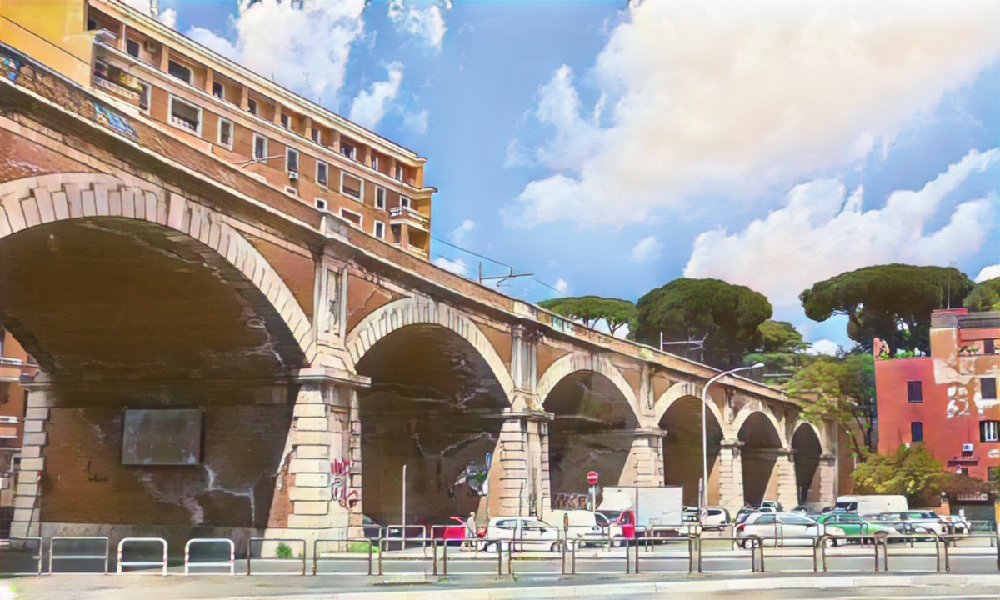
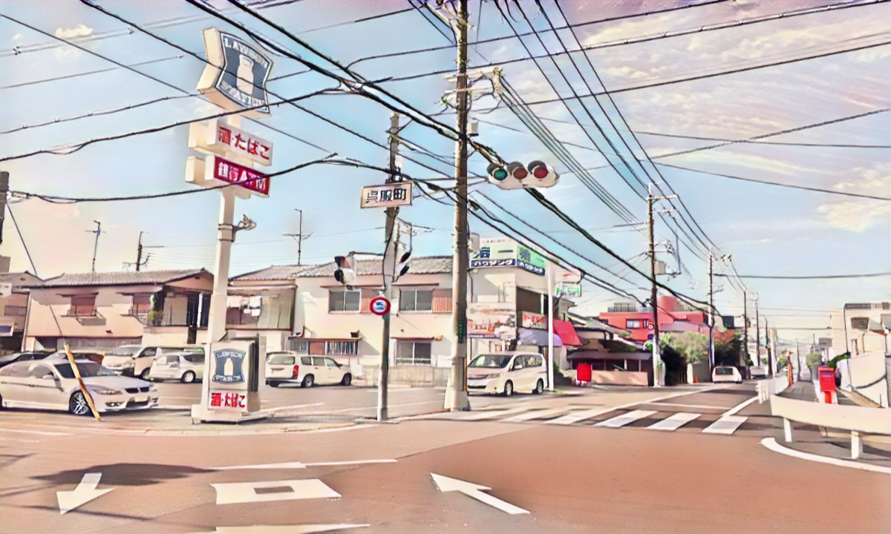
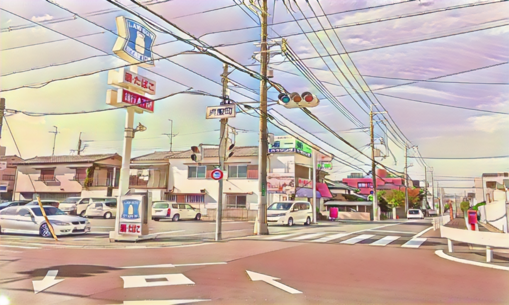

# CartoonGAN
a simple PyTorch implementation of CartoonGAN (CVPR 2018)

[](https://www.python.org/)
[](https://github.com/pytorch/pytorch)
[](https://github.com/numpy/numpy/)
[](https://github.com/opencv/opencv)
[](https://developer.nvidia.com/cuda-downloads)

## Usage

### 1.prepare dataset

The folder structure is as follows
```
├── data
│   ├── train # train real images
│   ├── test  # test real images 
│   ├── ShinKai # cartoon images
│   |── ...
│
├── outputs # generated images
│
├── main.py # training code
├── utils.py
├── config.py # some configs
```

### 2.preprocess cartoon images

```bash
python utils.py your_cartoon_image
```

### 3.train

```bash
python main.py --cartoon_name your_cartoon_image # yon can see more arguments in config.py
```

## Resutls

### 1.


<center><h5>input</h5></center>



<center><h5>ufotable</h5></center>



<center><h5>Kyoto Animation</h5></center>

### 2.


<center><h5>input</h5></center>



<center><h5>ufotable</h5></center>



<center><h5>Kyoto Animation</h5></center>

### 3.


<center><h5>input</h5></center>



<center><h5>ufotable</h5></center>



<center><h5>Kyoto Animation</h5></center>

### 4.


<center><h5>input</h5></center>



<center><h5>ufotable</h5></center>



<center><h5>Kyoto Animation</h5></center>

## Reference

[CartoonGAN-CVPR2018](http://openaccess.thecvf.com/content_cvpr_2018/papers/Chen_CartoonGAN_Generative_Adversarial_CVPR_2018_paper.pdf)

[pytorch-CartoonGAN by znxlwm](https://github.com/znxlwm/pytorch-CartoonGAN)